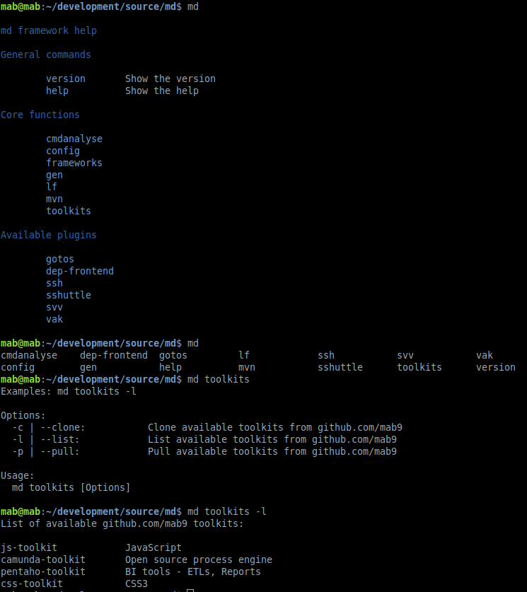

# md

<!--- These are examples. See https://shields.io for others or to customize this set of shields. You might want to include dependencies, project status and licence info here --->


<!---->

Md is a tool that allows developers to reduce their repetitive tasks.

The tool offers core functions and the possibility to integrate and use self written plugins to improve the dev workflow.
It aims to make it easier to work on different devices by providing the same functions.



## Installing md

To install md, follow these steps:

Linux:
```
git clone https://github.com/mab9/md.git
bash ./md/installation.sh
```

## Using md

To use md, follow these steps:

```
1. open a shell
2. enter md command "md"
3. help: md help | md | md -h
```

**Example: cmdanalyse lists the most used commands (possible aliases or workflow improvements)**

```
md cmdanalyse
 
     50 git status 
     41 exit  
     27 c  
     26 ls  
     ...
```

With this core function, you may decide to write an alias or improve your dev workflow with a self written plugin.

**Example: Create and use a new plugin. As example, we named the new plugin: magic.**

```
cd ./md/plugins
mkdir -p ./personal-plugins/magic        // create a git repo to manage your own plugins or just give your plugin a group name "personal-plugins"
touch ./personal-plugins/magic/magic.sh  // add your script code into the magic.sh file

md magic                                 // use the new plugin
```

*Hint* the group name or repository name must end with "-plugins"!

Have a look [here](https://codeburst.io/13-tips-tricks-for-writing-shell-scripts-with-awesome-ux-19a525ae05ae) for some bash tips and tricks. 

**Example: Add plugin files that shall be [sourced](https://linuxize.com/post/bash-source-command/) and accesible. It is useful to load functions, variables, and configuration files into shell scripts.**

```
touch ./personal-plugins/magic/resource.sh       // add a file named resource.sh into your plugin folder
```

All resource.sh files within the md folder will be sourced. See scripts/register.sh 

**Example: use different maven settings.xml files (instead to use a project config ;-))**

```
md mvn -c
 
Select new default mvn setting

1) settings-dab.xml     3) settings-security.xml    5) settings.xml
2) settings-empty.xml   4) settings-svv.xml         6) exit 
```

## Contributing to md
<!--- If your README is long or you have some specific process or steps you want contributors to follow, consider creating a separate CONTRIBUTING.md file--->
To contribute to md, follow these steps:

1. Fork this repository.
2. Create a branch: `git checkout -b <branch_name>`.
3. Make your changes and commit them: `git commit -m '<commit_message>'`
4. Push to the original branch: `git push origin md/<location>`
5. Create the pull request.

Alternatively see the GitHub documentation on [creating a pull request](https://help.github.com/en/github/collaborating-with-issues-and-pull-requests/creating-a-pull-request).

## My next ideas

- Make core scripts generic
- add md autocompletion
- Make installation script generic (installation path)
- Make private svv plugin execute set-docker-env on each terminal start, (md svv -i and -s use only one of them)   
- Extend the use of the working directory
- Add a logging script with a lot of infos about logging [like](https://sematext.com/blog/journald-logging-tutorial/)

## Contributors

Thanks to the following people who have contributed to this project:

* [@mab9](https://github.com/mab9) 📖

<!-- You might want to consider using something like the [All Contributors](https://github.com/all-contributors/all-contributors) specification and its [emoji key](https://allcontributors.org/docs/en/emoji-key). -->

## Contact

If you want to contact me you can reach me at **marcantoine.bruelhart@gmail.com.**

## License
<!--- If you're not sure which open license to use see https://choosealicense.com/--->

This project uses the following license: [GNU GPLv3](https://choosealicense.com/licenses/gpl-3.0/).


